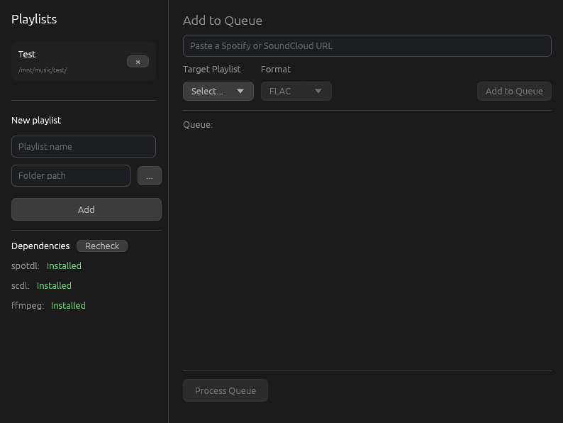

### playlist-fetcher
A desktop GUI for managing music downloads via `spotdl` and `scdl` built in Rust with egui.

## How to use
Create a "Playlist" and set a target folder in the side panel as a download directory, you can have as many as you like. Paste a Spotify of SoundCloud link, pick a target playlist and format if applicable and queue it up. It will download the tracks to the selected folder.
The app handles calling the correct downloader under the hood and organizing files into the folders you define.



## Features

- Define named playlists mapped to folders on the disk
- Detects Spotify of SoundCloud URLs automatically
- Select output format currently only supported by Spotify URLs
- Queue based downloads

## Installation

### Arch Linux

```bash
git clone https://github.com/howdydev/playlist-fetcher.git
cd playlist-fetcher
makepkg -si
```

### Build from source

Requires:

- [Rust](https://www.rust-lang.org/tools/install)
- [spotdl](https://github.com/spotDL/spotify-downloader)
- [scdl](https://github.com/scdl-org/scdl)
- ffmpeg

```bash
git clone https://github.com/howdydev/playlist-fetcher.git
cd playlist-fetcher
cargo build --release
```

## Stack

- Rust
- egui
- spotdl / scdl
- ffmpeg

## Development

Contributions, issues and suggestions are welcome. Feel free to open a PR or issue.

## License

[MIT](LICENSE)
